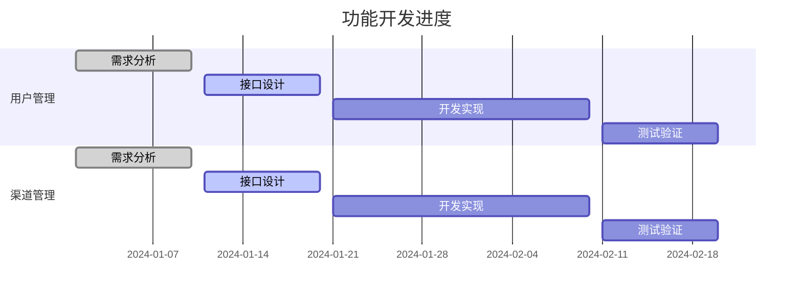

# 🚧 敬请期待

## 开发中...

我们正在努力开发更多功能，敬请期待！

### 计划功能

- 用户管理接口
- 渠道管理接口
- 配额管理接口
- 计费管理接口
- 系统配置接口

### 开发进度

### 订阅更新

如果您想第一时间了解最新进展，欢迎：

1. 在 GitHub 上 Star 和 Watch 我们的项目
2. 加入我们的交流社区
3. 关注项目动态

### 参与贡献

我们欢迎社区贡献，如果您有好的想法或建议：

1. 在 GitHub 上提交 Issue
2. 提交 Pull Request
3. 在社区中讨论

### 联系我们

如有任何问题或建议，欢迎通过以下方式联系我们：

- GitHub Issues
- 交流社区
- 电子邮件

> 感谢您的关注和支持！我们会加快开发进度，尽快为您带来更多功能。 