# Midjourney 图像格式（Midjourney Proxy/Midjourney Proxy Plus）

!!! note "请你注意"
    该接口 **非Midjourney官方的接口**，而是基于作者 **novicezk** 的开源项目 [**midjourney-proxy**](https://github.com/novicezk/midjourney-proxy) 实现的midjourney代理接口。
    
    该项目分为两个版本，New API 都已经适配：
    
    - 开源版 [midjourney-proxy](https://github.com/novicezk/midjourney-proxy)
    
    - 付费版 [midjourney-proxy-plus](https://github.com/litter-coder/midjourney-proxy-plus)

    这里非常感谢作者的贡献，让我们可以方便使用midjourney的强大功能，如果有时间，请给作者一个Star，如果有能力，建议支持作者的付费版本，该版本支持更多功能。

| 功能类别 | 开源版 | 付费版 |
|---------|--------|--------|
| **基础功能** | | |
| Imagine指令及相关动作 | ✓ | ✓ |
| 垫图支持 | ✓ | ✓ |
| Blend(图片混合) | ✓ | ✓ |
| Describe(图生文) | ✓ | ✓ |
| 任务实时进度 | ✓ | ✓ |
| 中文prompt翻译 | ✓ | ✓ |
| prompt敏感词检测 | ✓ | ✓ |
| user-token连接wss | ✓ | ✓ |
| 多账号配置 | ✓ | ✓ |
| **高级功能** | | |
| Shorten(prompt分析) | ✗ | ✓ |
| 焦点移动(Pan) | ✗ | ✓ |
| 图片变焦(Zoom) | ✗ | ✓ |
| 局部重绘(Vary Region) | ✗ | ✓ |
| 关联按钮动作和Remix模式 | ✗ | ✓ |
| 获取图片seed值 | ✗ | ✓ |
| **账号管理** | | |
| 账号池持久化 | ✗ | ✓ |
| 多种存储支持(Redis/MySQL) | ✗ | ✓ |
| 账号信息获取和设置 | ✗ | ✓ |
| 任务取消功能 | ✗ | ✓ |
| 内置管理后台 | ✗ | ✓ |
| **智能特性** | | |
| MJ V6.0支持 | ✗ | ✓ |
| 账号状态自动监控 | ✗ | ✓ |
| 模式自动切换 | ✗ | ✓ |
| niji・journey Bot支持 | ✗ | ✓ |
| InsightFace人脸服务 | ✗ | ✓ |
| **安全性能** | | |
| 动态配置支持 | ✗ | ✓ |
| token掉线问题修复 | ✗ | ✓ |
| 自动验证功能 | ✗ | ✓ |
| 违禁词自动申诉 | ✗ | ✓ |

## 📝 简介

Midjourney是一个强大的图像生成和处理模型，可以根据自然语言描述创建、编辑和修改图像。通过提供不同的接口，可以实现各种图像生成和处理任务。

## 🔄 流程示意图

```mermaid
graph TD
    A[开始] --> B{选择任务类型}
    
    %% Imagine 流程
    B -->|文生图| C[提交 Imagine 任务]
    C --> D[获得初始图片]
    D --> E{选择操作}
    
    %% 基础操作分支
    E -->|U1-U4| F[放大]
    E -->|V1-V4| G[变体]
    
    %% Blend 流程
    B -->|图片混合| H[提交 Blend 任务]
    H --> D
    
    %% Describe 流程
    B -->|图生文| I[提交 Describe 任务]
    I --> J[获得图片描述]
    
    %% Action & Modal 流程
    F --> K[提交 Action]
    G --> K
    K -->|需要弹窗| L[提交 Modal]
    K -->|直接执行| M[执行完成]
    L --> M
    
    %% Face Swap 流程
    B -->|人脸替换| N[提交 Swap Face 任务]
    N --> M
    
    %% 查询相关
    M --> O{后续操作}
    O -->|查询进度| P[获取任务详情]
    O -->|获取种子| Q[获取图片 Seed]
    O -->|保存图片| R[上传至 Discord]
    
    %% 样式定义
    classDef process fill:#f9f,stroke:#333,stroke-width:2px
    classDef decision fill:#bbf,stroke:#333,stroke-width:2px
    classDef endpoint fill:#bfb,stroke:#333,stroke-width:2px
    
    class A,M,J,R endpoint
    class B,E,O decision
    class C,D,F,G,H,I,K,L,N,P,Q process
```



### 流程说明

1. **初始任务**
   - Imagine: 文本生成图片
   - Blend: 多图混合
   - Describe: 图片描述
   - Swap Face: 人脸替换

2. **图片处理**
   - U1-U4: 放大操作
   - V1-V4: 变体生成
   - Pan: 图片平移
   - Zoom: 图片缩放

3. **特殊流程**
   - Action + Modal: 需要弹窗确认的操作
   - Action 直接执行: 不需要弹窗的操作

4. **任务管理**
   - 获取任务详情
   - 获取图片 Seed
   - 上传至 Discord

## 💡 请求示例

### 提交Imagine任务 ✅

```bash
curl --location --request POST 'https://newapi地址/mj/submit/imagine' \
--header 'Authorization: Bearer $NEWAPI_API_KEY' \
--header 'Accept: application/json' \
--header 'Content-Type: application/json' \
--data-raw '{
  "botType": "MID_JOURNEY",
  "prompt": "Cat",
  "base64Array": [],
  "accountFilter": {
    "channelId": "",
    "instanceId": "",
    "modes": [],
    "remark": "",
    "remix": true,
    "remixAutoConsidered": true
  },
  "notifyHook": "",
  "state": ""
}'
```

**响应示例:**

```json
{
  "code": 1,
  "description": "提交成功",
  "properties": {},
  "result": 1320098173412546
}
```

### 提交Blend任务 ✅

```bash
curl --location --request POST 'https://newapi地址/mj/submit/blend' \
--header 'Authorization: Bearer $NEWAPI_API_KEY' \
--header 'Accept: application/json' \
--header 'Content-Type: application/json' \
--data-raw '{
  "botType": "MID_JOURNEY",
  "base64Array": [
    "data:image/png;base64,xxx1",
    "data:image/png;base64,xxx2"
  ],
  "dimensions": "SQUARE",
  "accountFilter": {
    "channelId": "",
    "instanceId": "",
    "modes": [],
    "remark": "",
    "remix": true,
    "remixAutoConsidered": true
  },
  "notifyHook": "",
  "state": ""
}'
```

**响应示例:**

```json
{
  "code": 1,
  "description": "提交成功",
  "properties": {},
  "result": 1320098173412546
}
```

### 提交Describe任务 ✅

```bash
curl --location --request POST 'https://newapi地址/mj/submit/describe' \
--header 'Authorization: Bearer $NEWAPI_API_KEY' \
--header 'Accept: application/json' \
--header 'Content-Type: application/json' \
--data-raw '{
  "botType": "MID_JOURNEY",
  "base64": "data:image/png;base64,xxx",
  "accountFilter": {
    "channelId": "",
    "instanceId": "",
    "modes": [],
    "remark": "",
    "remix": true,
    "remixAutoConsidered": true
  },
  "notifyHook": "",
  "state": ""
}'
```

**响应示例:**

```json
{
  "code": 1,
  "description": "提交成功",
  "properties": {},
  "result": 1320098173412546
}
```

### 提交Modal ✅

```bash
curl --location --request POST 'https://newapi地址/mj/submit/modal' \
--header 'Authorization: Bearer $NEWAPI_API_KEY' \
--header 'Accept: application/json' \
--header 'Content-Type: application/json' \
--data-raw '{
  "maskBase64": "",
  "prompt": "",
  "taskId": "14001934816969359"
}'
```

**响应示例:**

```json
{
  "code": 1,
  "description": "提交成功",
  "properties": {},
  "result": 1320098173412546
}
```

### 提交swap_face任务 ✅

```bash
curl --location --request POST 'https://newapi地址/mj/insight-face/swap' \
--header 'Authorization: Bearer $NEWAPI_API_KEY' \
--header 'Accept: application/json' \
--header 'Content-Type: application/json' \
--data-raw '{
  "sourceBase64": "data:image/jpeg;base64,/9j/4AAQSkZJRgABAQAAAQABAAD/2wCEAAkGBwgHBgkIBwgKCgkLDRYPDQwMDRsUFRAWIB0iIiAdHx8kKDQsJCYxJx8fLT0tMTU3Ojo6Iys/RDnYdriP1wsS81kwU8OVs/R3xu8s6bX7+zYnOH8coSqpmRSBjqerjcBlr2OB/lbAf/2Q==",
  "targetBase64": "data:image/jpeg;base64,/9j/4AAQSkZJRgABAQAAAQABAAD/2wCEAAkGBwgHBgkIBwgKCgkLDRYPDQwMDRsUFRAWIB0iIiAdHx8kKDQsJCYxJx8fLT0tMTU3Ojo6Iys/RD849k="
}'
```

**响应示例:**

```json
{
  "code": 0,
  "description": "string",
  "result": "string"
}
```

### 执行Action动作 ✅

```bash
curl --location --request POST 'https://newapi地址/mj/submit/action' \
--header 'Authorization: Bearer $NEWAPI_API_KEY' \
--header 'Accept: application/json' \
--header 'Content-Type: application/json' \
--data-raw '{
  "chooseSameChannel": true,
  "customId": "MJ::JOB::upsample::1::82c51c9d-bc33-4c07-a471-36c3dcb1a6f0",
  "taskId": "1728781324658687",
  "accountFilter": {
    "channelId": "",
    "instanceId": "",
    "modes": [],
    "remark": "",
    "remix": true,
    "remixAutoConsidered": true
  },
  "notifyHook": "",
  "state": ""
}'
```

**响应示例:**

```json
{
  "code": 1,
  "description": "提交成功",
  "properties": {},
  "result": 1320098173412546
}
```

### 上传文件到discord ✅

```bash
curl --location --request POST 'https://newapi地址/mj/submit/upload-discord-images' \
--header 'Authorization: Bearer $NEWAPI_API_KEY' \
--header 'Accept: application/json' \
--header 'Content-Type: application/json' \
--data-raw '{
  "base64Array": [],
  "filter": {
    "channelId": "",
    "instanceId": "",
    "remark": ""
  }
}'
```

**响应示例:**

```json
{
  "code": 0,
  "description": "string",
  "result": [
    "string"
  ]
}
```

### 根据ID列表查询任务 ✅

```bash
curl --location --request POST 'https://newapi地址/mj/task/list-by-condition' \
--header 'Accept: application/json' \
--header 'Authorization: Bearer $NEWAPI_API_KEY' \
--header 'Content-Type: application/json' \
--data-raw '{
  "ids": []
}'
```

**响应示例:**

```json
[
  {
    "action": "IMAGINE",
    "buttons": [
      {
        "customId": "string",
        "emoji": "string",
        "label": "string",
        "style": 0,
        "type": 0
      }
    ],
    "description": "string",
    "failReason": "string",
    "finishTime": 0,
    "id": "string",
    "imageUrl": "string",
    "progress": "string",
    "prompt": "string",
    "promptEn": "string",
    "properties": {},
    "startTime": 0,
    "state": "string",
    "status": "NOT_START",
    "submitTime": 0
  }
]
```

### 指定ID获取任务 ✅

```bash
curl --location --request GET 'https://newapi地址/mj/task/{id}/fetch' \
--header 'Accept: application/json' \
--header 'Authorization: Bearer $NEWAPI_API_KEY' \
--header 'Content-Type: application/json'
```

**响应示例:**

```json
{
  "action": "IMAGINE",
  "buttons": [
    {
      "customId": "string",
      "emoji": "string",
      "label": "string",
      "style": 0,
      "type": 0
    }
  ],
  "description": "string", 
  "failReason": "string",
  "finishTime": 0,
  "id": "string",
  "imageUrl": "string",
  "progress": "string",
  "prompt": "string",
  "promptEn": "string",
  "properties": {},
  "startTime": 0,
  "state": "string",
  "status": "NOT_START",
  "submitTime": 0
}
```

### 获取任务图片的seed ✅

```bash
curl --location --request GET 'https://newapi地址/mj/task/{id}/image-seed' \
--header 'Accept: application/json' \
--header 'Authorization: Bearer $NEWAPI_API_KEY' \
--header 'Content-Type: application/json'
```

**响应示例:**

```json
{
  "code": 0,
  "description": "string",
  "result": "string"
}
```

## 📮 请求

### 端点

#### 提交Imagine任务
```
POST /mj/submit/imagine
```

根据文本提示创建图片。

#### 提交Blend任务
```
POST /mj/submit/blend
```

根据多个输入图片融合生成新图片。

#### 提交Describe任务
```
POST /mj/submit/describe
```

根据输入图片生成文字描述。

#### 提交Modal
```
POST /mj/submit/modal
```

提交模态信息,用于调整图片生成细节。

#### 提交swap_face任务 
```
POST /mj/insight-face/swap
```

根据源图片和目标图片进行人脸交换。

#### 执行Action动作
```
POST /mj/submit/action
```

对已生成的图片进行后续操作,如放大、调整等。

#### 上传文件到discord
```  
POST /mj/submit/upload-discord-images
```

将图片上传到discord平台。

#### 根据ID列表查询任务
```
POST /mj/task/list-by-condition
```

根据指定的任务ID列表查询任务详情。

#### 指定ID获取任务
```  
GET /mj/task/{id}/fetch
```

根据任务ID获取任务详情。

#### 获取任务图片的seed  
```
GET /mj/task/{id}/image-seed
```

获取指定任务生成图片的seed值。

### 鉴权方法

在请求头中包含以下内容进行 API 密钥认证：

```
Authorization: Bearer $NEWAPI_API_KEY$OPENAI_API_KEY
```

其中 `$OPENAI_API_KEY` 是您的 API 密钥。

### 请求体参数

#### 提交 Imagine 任务

##### `botType`
- 类型：枚举字符串
- 必需：否
- 默认值：MID_JOURNEY
- 可选值：
  - `MID_JOURNEY`: Midjourney 模型
  - `NIJI_JOURNEY`: Niji Journey 模型
- 说明：选择使用的 bot 类型

##### `prompt`
- 类型：字符串
- 必需：是
- 说明：图像生成的文本提示词
- 提示：
  - 使用清晰具体的描述
  - 可以包含艺术风格、构图等细节
  - 支持英文和中文输入

##### `base64Array`
- 类型：字符串数组
- 必需：否
- 说明：垫图的 base64 编码数组
- 格式：每个元素应为完整的 base64 图片字符串，包含 MIME 类型前缀

##### `accountFilter`
- 类型：对象
- 必需：否
- 属性：
  - `channelId`: 频道 ID
  - `instanceId`: 账号实例 ID
  - `modes`: 账号模式数组，可选值：RELAX、FAST、TURBO
  - `remark`: 备注包含的内容
  - `remix`: 账号是否支持 remix
  - `remixAutoConsidered`: remix 自动提交设置

##### `notifyHook`
- 类型：字符串
- 必需：否
- 说明：任务完成后的回调地址，为空时使用全局 notifyHook

##### `state`
- 类型：字符串
- 必需：否
- 说明：自定义状态参数，可用于跟踪请求

#### 提交 Blend 任务

##### `base64Array`
- 类型：字符串数组
- 必需：是
- 说明：要混合的图片 base64 编码数组
- 格式：必须包含 2-5 张图片的 base64 字符串

##### `dimensions`
- 类型：枚举字符串
- 必需：否
- 可选值：
  - `PORTRAIT`: 2:3 比例
  - `SQUARE`: 1:1 比例
  - `LANDSCAPE`: 3:2 比例
- 说明：输出图片的宽高比设置

#### 提交 Describe 任务

##### `base64`
- 类型：字符串
- 必需：是
- 说明：需要描述的图片的 base64 编码
- 格式：完整的 base64 字符串，包含 MIME 类型前缀

#### 提交 Modal 任务

##### `maskBase64`
- 类型：字符串
- 必需：否
- 说明：局部重绘的蒙版图片 base64 编码

##### `prompt`
- 类型：字符串
- 必需：否
- 说明：重绘区域的文本提示词

##### `taskId`
- 类型：字符串
- 必需：是
- 说明：原始任务的 ID

#### 提交 Swap Face 任务

##### `sourceBase64`
- 类型：字符串
- 必需：是
- 说明：人脸源图片的 base64 编码
- 要求：图片必须包含清晰的人脸

##### `targetBase64`
- 类型：字符串
- 必需：是
- 说明：目标图片的 base64 编码
- 要求：图片必须包含要替换的人脸

#### 执行 Action 动作

##### `chooseSameChannel`
- 类型：布尔值
- 必需：否
- 默认值：false
- 说明：是否选择同一频道下的账号

##### `customId`
- 类型：字符串
- 必需：是
- 说明：动作标识符
- 格式：特定格式的字符串，如 "MJ::JOB::upsample::1::xxx"

##### `taskId`
- 类型：字符串
- 必需：是
- 说明：要执行动作的任务 ID

#### 上传文件到 Discord

##### `base64Array`
- 类型：字符串数组
- 必需：是
- 说明：要上传的图片 base64 编码数组

##### `filter`
- 类型：对象
- 必需：否
- 属性：
  - `channelId`: 目标频道 ID
  - `instanceId`: 账号实例 ID
  - `remark`: 备注信息

#### 根据 ID 列表查询任务

##### `ids`
- 类型：字符串数组
- 必需：是
- 说明：要查询的任务 ID 列表

### 通用响应格式

所有接口都返回相似的响应结构：

##### `code`
- 类型：整数
- 说明：状态码

| 状态码 | 说明 |
|--------|------|
| 1 | 提交成功 |
| 22 | 任务排队中 |
| 21 | 参数错误 |
| 23 | 系统错误 |
| 24 | 账号不可用 |
| 25 | 余额不足 |

##### `description`
- 类型：字符串
- 说明：响应描述信息

##### `properties`
- 类型：对象
- 说明：扩展属性

##### `result`
- 类型：字符串或数组
- 说明：返回结果，可能是任务 ID 或其他数据

## 📥 响应

### 成功响应

#### `action`
- 类型：枚举字符串
- 说明：任务类型

| 字符串值 | 说明 |
|--------|------|
| `IMAGINE` | 创建图片 |
| `UPSCALE` | 放大图片 |
| `VARIATION` | 变体生成 |
| `ZOOM` | 缩放图片 |
| `PAN` | 平移图片 |
| `DESCRIBE` | 图片描述 |
| `BLEND` | 图片混合 |
| `SHORTEN` | 缩短提示词 |
| `SWAP_FACE` | 人脸替换 |

#### `buttons`
- 类型：对象数组
- 说明：可执行的操作按钮

| 数组包含属性 | 说明 |
|--------|------|
| `customId` | 动作标识 |
| `emoji` | 按钮图标 |
| `label` | 按钮文本 |
| `style` | 样式(2=Primary, 3=Green) |
| `type` | 系统内部使用的类型 |

#### `description`
- 类型：字符串
- 说明：任务描述信息

#### `failReason`
- 类型：字符串
- 说明：任务失败原因

#### `finishTime`
- 类型：整数
- 说明：任务完成时间戳

#### `id`
- 类型：字符串
- 说明：任务唯一标识符

#### `imageUrl`
- 类型：字符串
- 说明：生成图片的URL

#### `progress`
- 类型：字符串
- 说明：任务进度信息

#### `prompt`
- 类型：字符串
- 说明：原始提示词

#### `promptEn`
- 类型：字符串
- 说明：英文提示词

#### `status`
- 类型：枚举字符串
- 说明：任务状态

| 字符串值 | 说明 |
|--------|------|
| `NOT_START` | 未开始 |
| `SUBMITTED` | 已提交 |
| `MODAL` | 模态操作中 |
| `IN_PROGRESS` | 进行中 |
| `FAILURE` | 失败 |
| `SUCCESS` | 成功 |
| `CANCEL` | 已取消 |

#### `submitTime`
- 类型：整数
- 说明：任务提交时间戳

#### `startTime`
- 类型：整数
- 说明：任务开始执行时间戳

### 错误响应

当请求出现问题时，API 将返回错误响应：

#### HTTP 状态码
- `400 Bad Request`: 请求参数无效
- `401 Unauthorized`: API 密钥无效或未提供
- `403 Forbidden`: 权限不足
- `404 Not Found`: 资源不存在
- `429 Too Many Requests`: 请求频率超限
- `500 Internal Server Error`: 服务器内部错误

#### 错误响应格式
```json
{
  "code": <错误码>,
  "description": "错误描述信息",
  "result": null
}
```

## 💡 最佳实践

### Prompt 编写建议

1. 使用清晰简洁的语言描述期望的图像内容
2. 可以参考Midjourney支持的各种参数来控制图片风格
3. 适当使用否定描述以排除不需要的元素
4. 可以通过图片URL作为参考来指导生成

### 图片生成流程

1. 提交Imagine任务,获得初步图片
2. 必要时通过Blend、Modal等任务进一步优化
3. 执行Action动作进行图片微调
4. 将满意的结果图片上传保存

### 图片格式要求

1. 支持的图片格式：
   
   - JPEG/JPG
   
   - PNG
   
   - GIF (静态)
   
   - WEBP

2. 图片大小限制：
   
   - 文件大小：最大 4MB
   
   - 分辨率：建议 1024x1024 或更高
   
   - 宽高比：支持 1:1、2:3、3:2

### 性能优化建议

1. Base64 编码：
   
   - 使用标准 Base64 编码格式
   
   - 包含正确的 MIME 类型前缀
   
   - 压缩图片以减少数据传输

2. 任务处理：
   
   - 使用 webhook 接收任务完成通知
   
   - 合理设置重试策略
   
   - 建议使用异步处理方式

### 错误处理

   - 实现请求重试机制
   
   - 添加错误日志记录
   
   - 设置合理的超时时间
