# OpenAI 实时对话接口

> 官方文档请参阅：

> [OpenAI Realtime WebRTC](https://platform.openai.com/docs/guides/realtime-webrtc)

> [OpenAI Realtime WebSocket](https://platform.openai.com/docs/guides/realtime-websocket)

## 📝 概述

### 简介
OpenAI Realtime API 提供两种连接方式：

1. WebRTC - 适用于浏览器和移动客户端的实时音视频交互

2. WebSocket - 适用于服务器到服务器的应用程序集成

### 使用场景
- 实时语音对话
- 音视频会议
- 实时翻译
- 语音转写
- 实时代码生成
- 服务器端实时集成

### 主要特性
- 双向音频流传输
- 文本和音频混合对话
- 函数调用支持
- 自动语音检测(VAD)
- 音频转写功能
- WebSocket 服务器端集成

## 🔐 认证与安全

### 认证方式
1. 标准 API 密钥 (仅服务器端使用)
2. 临时令牌 (客户端使用)

### 临时令牌
- 有效期: 1分钟
- 使用限制: 单个连接
- 获取方式: 通过服务器端 API 创建

```http
POST https://newapi地址/v1/realtime/sessions
Content-Type: application/json
Authorization: Bearer $NEW_API_KEY

{
  "model": "gpt-4o-realtime-preview-2024-12-17",
  "voice": "verse"
}
```

### 安全建议
- 永远不要在客户端暴露标准 API 密钥
- 使用 HTTPS/WSS 进行通信
- 实现适当的访问控制
- 监控异常活动

## 🔌 连接建立

### WebRTC 连接
- URL: `https://newapi地址/v1/realtime`
- 查询参数: `model`
- 请求头: 
  - `Authorization: Bearer EPHEMERAL_KEY`
  - `Content-Type: application/sdp`

### WebSocket 连接
- URL: `wss://newapi地址/v1/realtime`
- 查询参数: `model`
- 请求头:
  - `Authorization: Bearer YOUR_API_KEY`
  - `OpenAI-Beta: realtime=v1`

### 连接流程

```mermaid
sequenceDiagram
    participant Client
    participant Server
    participant OpenAI
    
    alt WebRTC 连接
        Client->>Server: 请求临时令牌
        Server->>OpenAI: 创建会话
        OpenAI-->>Server: 返回临时令牌
        Server-->>Client: 返回临时令牌
        
        Client->>OpenAI: 创建 WebRTC offer
        OpenAI-->>Client: 返回 answer
        
        Note over Client,OpenAI: 建立 WebRTC 连接
        
        Client->>OpenAI: 创建数据通道
        OpenAI-->>Client: 确认数据通道
    else WebSocket 连接
        Server->>OpenAI: 建立 WebSocket 连接
        OpenAI-->>Server: 确认连接
        
        Note over Server,OpenAI: 开始实时对话
    end
```



### 数据通道
- 名称: `oai-events`
- 用途: 事件传输
- 格式: JSON

### 音频流
- 输入: `addTrack()`
- 输出: `ontrack` 事件

## 💬 对话交互

### 对话模式
1. 纯文本对话
2. 语音对话
3. 混合对话

### 会话管理
- 创建会话
- 更新会话
- 结束会话
- 会话配置

### 事件类型
- 文本事件
- 音频事件
- 函数调用
- 状态更新
- 错误事件

## ⚙️ 配置选项

### 音频配置
- 输入格式
  - `pcm16`
  - `g711_ulaw`
  - `g711_alaw`
- 输出格式
  - `pcm16`
  - `g711_ulaw`
  - `g711_alaw`
- 语音类型
  - `alloy`
  - `echo`
  - `shimmer`

### 模型配置
- 温度
- 最大输出长度
- 系统提示词
- 工具配置

### VAD 配置
- 阈值
- 静音时长
- 前缀填充

## 🚀 代码示例

### WebRTC 连接示例

#### 客户端实现 (浏览器)
```javascript
async function init() {
  // 从服务器获取临时密钥 - 参见下方服务器代码
  const tokenResponse = await fetch("/session");
  const data = await tokenResponse.json();
  const EPHEMERAL_KEY = data.client_secret.value;

  // 创建对等连接
  const pc = new RTCPeerConnection();

  // 设置播放模型返回的远程音频
  const audioEl = document.createElement("audio");
  audioEl.autoplay = true;
  pc.ontrack = e => audioEl.srcObject = e.streams[0];

  // 添加浏览器麦克风输入的本地音频轨道
  const ms = await navigator.mediaDevices.getUserMedia({
    audio: true
  });
  pc.addTrack(ms.getTracks()[0]);

  // 设置用于发送和接收事件的数据通道
  const dc = pc.createDataChannel("oai-events");
  dc.addEventListener("message", (e) => {
    // 这里接收实时服务器事件！
    console.log(e);
  });

  // 使用会话描述协议(SDP)启动会话
  const offer = await pc.createOffer();
  await pc.setLocalDescription(offer);

  const baseUrl = "https://newapi地址/v1/realtime";
  const model = "gpt-4o-realtime-preview-2024-12-17";
  const sdpResponse = await fetch(`${baseUrl}?model=${model}`, {
    method: "POST",
    body: offer.sdp,
    headers: {
      Authorization: `Bearer ${EPHEMERAL_KEY}`,
      "Content-Type": "application/sdp"
    },
  });

  const answer = {
    type: "answer",
    sdp: await sdpResponse.text(),
  };
  await pc.setRemoteDescription(answer);
}

init();
```

#### 服务器端实现 (Node.js)
```javascript
import express from "express";

const app = express();

// 创建一个端点用于生成临时令牌
// 该端点与上面的客户端代码配合使用
app.get("/session", async (req, res) => {
  const r = await fetch("https://newapi地址/v1/realtime/sessions", {
    method: "POST",
    headers: {
      "Authorization": `Bearer ${process.env.OPENAI_API_KEY}`,
      "Content-Type": "application/json",
    },
    body: JSON.stringify({
      model: "gpt-4o-realtime-preview-2024-12-17",
      voice: "verse",
    }),
  });
  const data = await r.json();

  // 将从OpenAI REST API收到的JSON发送回客户端
  res.send(data);
});

app.listen(3000);
```

#### WebRTC 事件收发示例
```javascript
// 从对等连接创建数据通道
const dc = pc.createDataChannel("oai-events");

// 监听数据通道上的服务器事件
// 事件数据需要从JSON字符串解析
dc.addEventListener("message", (e) => {
  const realtimeEvent = JSON.parse(e.data);
  console.log(realtimeEvent);
});

// 发送客户端事件：将有效的客户端事件序列化为
// JSON，并通过数据通道发送
const responseCreate = {
  type: "response.create",
  response: {
    modalities: ["text"],
    instructions: "Write a haiku about code",
  },
};
dc.send(JSON.stringify(responseCreate));
```

### WebSocket 连接示例

#### Node.js (ws模块)
```javascript
import WebSocket from "ws";

const url = "wss://api.openai.com/v1/realtime?model=gpt-4o-realtime-preview-2024-12-17";
const ws = new WebSocket(url, {
  headers: {
    "Authorization": "Bearer " + process.env.OPENAI_API_KEY,
    "OpenAI-Beta": "realtime=v1",
  },
});

ws.on("open", function open() {
  console.log("Connected to server.");
});

ws.on("message", function incoming(message) {
  console.log(JSON.parse(message.toString()));
});
```

#### Python (websocket-client)
```python
# 需要安装 websocket-client 库:
# pip install websocket-client

import os
import json
import websocket

OPENAI_API_KEY = os.environ.get("OPENAI_API_KEY")

url = "wss://api.openai.com/v1/realtime?model=gpt-4o-realtime-preview-2024-12-17"
headers = [
    "Authorization: Bearer " + OPENAI_API_KEY,
    "OpenAI-Beta: realtime=v1"
]

def on_open(ws):
    print("Connected to server.")

def on_message(ws, message):
    data = json.loads(message)
    print("Received event:", json.dumps(data, indent=2))

ws = websocket.WebSocketApp(
    url,
    header=headers,
    on_open=on_open,
    on_message=on_message,
)

ws.run_forever()
```

#### 浏览器 (标准WebSocket)
```javascript
/*
注意：在浏览器等客户端环境中，我们建议使用WebRTC。
但在Deno和Cloudflare Workers等类浏览器环境中，
也可以使用标准WebSocket接口。
*/

const ws = new WebSocket(
  "wss://api.openai.com/v1/realtime?model=gpt-4o-realtime-preview-2024-12-17",
  [
    "realtime",
    // 认证
    "openai-insecure-api-key." + OPENAI_API_KEY, 
    // 可选
    "openai-organization." + OPENAI_ORG_ID,
    "openai-project." + OPENAI_PROJECT_ID,
    // Beta协议，必需
    "openai-beta.realtime-v1"
  ]
);

ws.on("open", function open() {
  console.log("Connected to server.");
});

ws.on("message", function incoming(message) {
  console.log(message.data);
});
```

#### 消息收发示例

##### Node.js/浏览器
```javascript
// 接收服务器事件
ws.on("message", function incoming(message) {
  // 需要从JSON解析消息数据
  const serverEvent = JSON.parse(message.data)
  console.log(serverEvent);
});

// 发送事件，创建符合客户端事件格式的JSON数据结构
const event = {
  type: "response.create",
  response: {
    modalities: ["audio", "text"],
    instructions: "Give me a haiku about code.",
  }
};
ws.send(JSON.stringify(event));
```

##### Python
```python
# 发送客户端事件，将字典序列化为JSON
def on_open(ws):
    print("Connected to server.")
    
    event = {
        "type": "response.create",
        "response": {
            "modalities": ["text"],
            "instructions": "Please assist the user."
        }
    }
    ws.send(json.dumps(event))

# 接收消息需要从JSON解析消息负载
def on_message(ws, message):
    data = json.loads(message)
    print("Received event:", json.dumps(data, indent=2))
```

## ⚠️ 错误处理

### 常见错误
1. 连接错误
   - 网络问题
   - 认证失败
   - 配置错误
2. 音频错误
   - 设备权限
   - 格式不支持
   - 编解码问题
3. 会话错误
   - 令牌过期
   - 会话超时
   - 并发限制

### 错误恢复
1. 自动重连
2. 会话恢复
3. 错误重试
4. 降级处理

## 📝 事件参考

### 通用请求头

所有事件都需要包含以下请求头:

| 请求头 | 类型 | 说明 | 示例值 |
|--------|------|------|---------|
| Authorization | 字符串 | 认证令牌 | Bearer $NEW_API_KEY |
| OpenAI-Beta | 字符串 | API 版本 | realtime=v1 |

### 客户端事件

#### session.update

更新会话的默认配置。

| 参数 | 类型 | 必需 | 说明 | 示例值/可选值 |
|------|------|------|------|---------------|
| event_id | 字符串 | 否 | 客户端生成的事件标识符 | event_123 |
| type | 字符串 | 否 | 事件类型 | session.update |
| modalities | 字符串数组 | 否 | 模型可以响应的模态类型 | ["text", "audio"] |
| instructions | 字符串 | 否 | 预置到模型调用前的系统指令 | "Your knowledge cutoff is 2023-10..." |
| voice | 字符串 | 否 | 模型使用的语音类型 | alloy、echo、shimmer |
| input_audio_format | 字符串 | 否 | 输入音频格式 | pcm16、g711_ulaw、g711_alaw |
| output_audio_format | 字符串 | 否 | 输出音频格式 | pcm16、g711_ulaw、g711_alaw |
| input_audio_transcription.model | 字符串 | 否 | 用于转写的模型 | whisper-1 |
| turn_detection.type | 字符串 | 否 | 语音检测类型 | server_vad |
| turn_detection.threshold | 数字 | 否 | VAD 激活阈值(0.0-1.0) | 0.8 |
| turn_detection.prefix_padding_ms | 整数 | 否 | 语音开始前包含的音频时长 | 500 |
| turn_detection.silence_duration_ms | 整数 | 否 | 检测语音停止的静音持续时间 | 1000 |
| tools | 数组 | 否 | 模型可用的工具列表 | [] |
| tool_choice | 字符串 | 否 | 模型选择工具的方式 | auto/none/required |
| temperature | 数字 | 否 | 模型采样温度 | 0.8 |
| max_output_tokens | 字符串/整数 | 否 | 单次响应最大token数 | "inf"/4096 |

#### input_audio_buffer.append

向输入音频缓冲区追加音频数据。

| 参数 | 类型 | 必需 | 说明 | 示例值 |
|------|------|------|------|--------|
| event_id | 字符串 | 否 | 客户端生成的事件标识符 | event_456 |
| type | 字符串 | 否 | 事件类型 | input_audio_buffer.append |
| audio | 字符串 | 否 | Base64编码的音频数据 | Base64EncodedAudioData |

#### input_audio_buffer.commit

将缓冲区中的音频数据提交为用户消息。

| 参数 | 类型 | 必需 | 说明 | 示例值 |
|------|------|------|------|--------|
| event_id | 字符串 | 否 | 客户端生成的事件标识符 | event_789 |
| type | 字符串 | 否 | 事件类型 | input_audio_buffer.commit |

#### input_audio_buffer.clear

清空输入音频缓冲区中的所有音频数据。

| 参数 | 类型 | 必需 | 说明 | 示例值 |
|------|------|------|------|--------|
| event_id | 字符串 | 否 | 客户端生成的事件标识符 | event_012 |
| type | 字符串 | 否 | 事件类型 | input_audio_buffer.clear |

#### conversation.item.create

向对话中添加新的对话项。

| 参数 | 类型 | 必需 | 说明 | 示例值 |
|------|------|------|------|--------|
| event_id | 字符串 | 否 | 客户端生成的事件标识符 | event_345 |
| type | 字符串 | 否 | 事件类型 | conversation.item.create |
| previous_item_id | 字符串 | 否 | 新对话项将插入在此ID之后 | null |
| item.id | 字符串 | 否 | 对话项的唯一标识符 | msg_001 |
| item.type | 字符串 | 否 | 对话项类型 | message/function_call/function_call_output |
| item.status | 字符串 | 否 | 对话项状态 | completed/in_progress/incomplete |
| item.role | 字符串 | 否 | 消息发送者的角色 | user/assistant/system |
| item.content | 数组 | 否 | 消息内容 | [text/audio/transcript] |
| item.call_id | 字符串 | 否 | 函数调用的ID | call_001 |
| item.name | 字符串 | 否 | 被调用的函数名称 | function_name |
| item.arguments | 字符串 | 否 | 函数调用的参数 | {"param": "value"} |
| item.output | 字符串 | 否 | 函数调用的输出结果 | {"result": "value"} |

#### conversation.item.truncate

截断助手消息中的音频内容。

| 参数 | 类型 | 必需 | 说明 | 示例值 |
|------|------|------|------|--------|
| event_id | 字符串 | 否 | 客户端生成的事件标识符 | event_678 |
| type | 字符串 | 否 | 事件类型 | conversation.item.truncate |
| item_id | 字符串 | 否 | 要截断的助手消息项的ID | msg_002 |
| content_index | 整数 | 否 | 要截断的内容部分的索引 | 0 |
| audio_end_ms | 整数 | 否 | 音频截断的结束时间点 | 1500 |

#### conversation.item.delete

从对话历史中删除指定的对话项。

| 参数 | 类型 | 必需 | 说明 | 示例值 |
|------|------|------|------|--------|
| event_id | 字符串 | 否 | 客户端生成的事件标识符 | event_901 |
| type | 字符串 | 否 | 事件类型 | conversation.item.delete |
| item_id | 字符串 | 否 | 要删除的对话项的ID | msg_003 |

#### response.create

触发响应生成。

| 参数 | 类型 | 必需 | 说明 | 示例值 |
|------|------|------|------|--------|
| event_id | 字符串 | 否 | 客户端生成的事件标识符 | event_234 |
| type | 字符串 | 否 | 事件类型 | response.create |
| response.modalities | 字符串数组 | 否 | 响应的模态类型 | ["text", "audio"] |
| response.instructions | 字符串 | 否 | 给模型的指令 | "Please assist the user." |
| response.voice | 字符串 | 否 | 模型使用的语音类型 | alloy/echo/shimmer |
| response.output_audio_format | 字符串 | 否 | 输出音频格式 | pcm16 |
| response.tools | 数组 | 否 | 模型可用的工具列表 | ["type", "name", "description"] |
| response.tool_choice | 字符串 | 否 | 模型选择工具的方式 | auto |
| response.temperature | 数字 | 否 | 采样温度 | 0.7 |
| response.max_output_tokens | 整数/字符串 | 否 | 最大输出token数 | 150/"inf" |

#### response.cancel

取消正在进行中的响应生成。

| 参数 | 类型 | 必需 | 说明 | 示例值 |
|------|------|------|------|--------|
| event_id | 字符串 | 否 | 客户端生成的事件标识符 | event_567 |
| type | 字符串 | 否 | 事件类型 | response.cancel |

### 服务端事件

#### error

当发生错误时返回的事件。

| 参数 | 类型 | 必需 | 说明 | 示例值 |
|------|------|------|------|--------|
| event_id | 字符串数组 | 否 | 服务端事件的唯一标识符 | ["event_890"] |
| type | 字符串 | 否 | 事件类型 | error |
| error.type | 字符串 | 否 | 错误类型 | invalid_request_error/server_error |
| error.code | 字符串 | 否 | 错误代码 | invalid_event |
| error.message | 字符串 | 否 | 人类可读的错误消息 | "The 'type' field is missing." |
| error.param | 字符串 | 否 | 与错误相关的参数 | null |
| error.event_id | 字符串 | 否 | 相关事件的ID | event_567 |

#### conversation.item.input_audio_transcription.completed

当启用输入音频转写功能并且转写成功时返回此事件。

| 参数 | 类型 | 必需 | 说明 | 示例值 |
|------|------|------|------|--------|
| event_id | 字符串 | 否 | 服务端事件的唯一标识符 | event_2122 |
| type | 字符串 | 否 | 事件类型 | conversation.item.input_audio_transcription.completed |
| item_id | 字符串 | 否 | 用户消息项的ID | msg_003 |
| content_index | 整数 | 否 | 包含音频的内容部分的索引 | 0 |
| transcript | 字符串 | 否 | 转写的文本内容 | "Hello, how are you?" |

#### conversation.item.input_audio_transcription.failed

当配置了输入音频转写功能,但用户消息的转写请求失败时返回此事件。

| 参数 | 类型 | 必需 | 说明 | 示例值 |
|------|------|------|------|--------|
| event_id | 字符串 | 否 | 服务端事件的唯一标识符 | event_2324 |
| type | 字符串数组 | 否 | 事件类型 | ["conversation.item.input_audio_transcription.failed"] |
| item_id | 字符串 | 否 | 用户消息项的ID | msg_003 |
| content_index | 整数 | 否 | 包含音频的内容部分的索引 | 0 |
| error.type | 字符串 | 否 | 错误类型 | transcription_error |
| error.code | 字符串 | 否 | 错误代码 | audio_unintelligible |
| error.message | 字符串 | 否 | 人类可读的错误消息 | "The audio could not be transcribed." |
| error.param | 字符串 | 否 | 与错误相关的参数 | null |

#### conversation.item.truncated

当客户端截断了之前的助手音频消息项时返回此事件。

| 参数 | 类型 | 必需 | 说明 | 示例值 |
|------|------|------|------|--------|
| event_id | 字符串 | 否 | 服务端事件的唯一标识符 | event_2526 |
| type | 字符串 | 否 | 事件类型 | conversation.item.truncated |
| item_id | 字符串 | 否 | 被截断的助手消息项的ID | msg_004 |
| content_index | 整数 | 否 | 被截断的内容部分的索引 | 0 |
| audio_end_ms | 整数 | 否 | 音频被截断的时间点(毫秒) | 1500 |

#### conversation.item.deleted

当对话中的某个项目被删除时返回此事件。

| 参数 | 类型 | 必需 | 说明 | 示例值 |
|------|------|------|------|--------|
| event_id | 字符串 | 否 | 服务端事件的唯一标识符 | event_2728 |
| type | 字符串 | 否 | 事件类型 | conversation.item.deleted |
| item_id | 字符串 | 否 | 被删除的对话项的ID | msg_005 |

#### input_audio_buffer.committed

当音频缓冲区中的数据被提交时返回此事件。

| 参数 | 类型 | 必需 | 说明 | 示例值 |
|------|------|------|------|--------|
| event_id | 字符串 | 否 | 服务端事件的唯一标识符 | event_1121 |
| type | 字符串 | 否 | 事件类型 | input_audio_buffer.committed |
| previous_item_id | 字符串 | 否 | 新对话项将插入在此ID对应的对话项之后 | msg_001 |
| item_id | 字符串 | 否 | 将要创建的用户消息项的ID | msg_002 |

#### input_audio_buffer.cleared

当客户端清空输入音频缓冲区时返回此事件。

| 参数 | 类型 | 必需 | 说明 | 示例值 |
|------|------|------|------|--------|
| event_id | 字符串 | 否 | 服务端事件的唯一标识符 | event_1314 |
| type | 字符串 | 否 | 事件类型 | input_audio_buffer.cleared |

#### input_audio_buffer.speech_started

在服务器语音检测模式下，当检测到语音输入时返回此事件。

| 参数 | 类型 | 必需 | 说明 | 示例值 |
|------|------|------|------|--------|
| event_id | 字符串 | 否 | 服务端事件的唯一标识符 | event_1516 |
| type | 字符串 | 否 | 事件类型 | input_audio_buffer.speech_started |
| audio_start_ms | 整数 | 否 | 从会话开始到检测到语音的毫秒数 | 1000 |
| item_id | 字符串 | 否 | 语音停止时将创建的用户消息项的ID | msg_003 |

#### input_audio_buffer.speech_stopped

在服务器语音检测模式下，当检测到语音输入停止时返回此事件。

| 参数 | 类型 | 必需 | 说明 | 示例值 |
|------|------|------|------|--------|
| event_id | 字符串 | 否 | 服务端事件的唯一标识符 | event_1718 |
| type | 字符串 | 否 | 事件类型 | input_audio_buffer.speech_stopped |
| audio_start_ms | 整数 | 否 | 从会话开始到检测到语音停止的毫秒数 | 2000 |
| item_id | 字符串 | 否 | 将要创建的用户消息项的ID | msg_003 |

#### response.created

当创建新的响应时返回此事件。

| 参数 | 类型 | 必需 | 说明 | 示例值 |
|------|------|------|------|--------|
| event_id | 字符串 | 否 | 服务端事件的唯一标识符 | event_2930 |
| type | 字符串 | 否 | 事件类型 | response.created |
| response.id | 字符串 | 否 | 响应的唯一标识符 | resp_001 |
| response.object | 字符串 | 否 | 对象类型 | realtime.response |
| response.status | 字符串 | 否 | 响应的状态 | in_progress |
| response.status_details | 对象 | 否 | 状态的附加详细信息 | null |
| response.output | 字符串数组 | 否 | 响应生成的输出项列表 | ["[]"] |
| response.usage | 对象 | 否 | 响应的使用统计信息 | null |

#### response.done

当响应完成流式传输时返回此事件。

| 参数 | 类型 | 必需 | 说明 | 示例值 |
|------|------|------|------|--------|
| event_id | 字符串 | 否 | 服务端事件的唯一标识符 | event_3132 |
| type | 字符串 | 否 | 事件类型 | response.done |
| response.id | 字符串 | 否 | 响应的唯一标识符 | resp_001 |
| response.object | 字符串 | 否 | 对象类型 | realtime.response |
| response.status | 字符串 | 否 | 响应的最终状态 | completed/cancelled/failed/incomplete |
| response.status_details | 对象 | 否 | 状态的附加详细信息 | null |
| response.output | 字符串数组 | 否 | 响应生成的输出项列表 | ["[...]"] |
| response.usage.total_tokens | 整数 | 否 | 总token数 | 50 |
| response.usage.input_tokens | 整数 | 否 | 输入token数 | 20 |
| response.usage.output_tokens | 整数 | 否 | 输出token数 | 30 |

#### response.output_item.added

当响应生成过程中创建新的输出项时返回此事件。

| 参数 | 类型 | 必需 | 说明 | 示例值 |
|------|------|------|------|--------|
| event_id | 字符串 | 否 | 服务端事件的唯一标识符 | event_3334 |
| type | 字符串 | 否 | 事件类型 | response.output_item.added |
| response_id | 字符串 | 否 | 输出项所属的响应ID | resp_001 |
| output_index | 字符串 | 否 | 输出项在响应中的索引 | 0 |
| item.id | 字符串 | 否 | 输出项的唯一标识符 | msg_007 |
| item.object | 字符串 | 否 | 对象类型 | realtime.item |
| item.type | 字符串 | 否 | 输出项类型 | message/function_call/function_call_output |
| item.status | 字符串 | 否 | 输出项状态 | in_progress/completed |
| item.role | 字符串 | 否 | 与输出项关联的角色 | assistant |
| item.content | 数组 | 否 | 输出项的内容 | ["type", "text", "audio", "transcript"] |

#### response.output_item.done

当输出项完成流式传输时返回此事件。

| 参数 | 类型 | 必需 | 说明 | 示例值 |
|------|------|------|------|--------|
| event_id | 字符串 | 否 | 服务端事件的唯一标识符 | event_3536 |
| type | 字符串 | 否 | 事件类型 | response.output_item.done |
| response_id | 字符串 | 否 | 输出项所属的响应ID | resp_001 |
| output_index | 字符串 | 否 | 输出项在响应中的索引 | 0 |
| item.id | 字符串 | 否 | 输出项的唯一标识符 | msg_007 |
| item.object | 字符串 | 否 | 对象类型 | realtime.item |
| item.type | 字符串 | 否 | 输出项类型 | message/function_call/function_call_output |
| item.status | 字符串 | 否 | 输出项的最终状态 | completed/incomplete |
| item.role | 字符串 | 否 | 与输出项关联的角色 | assistant |
| item.content | 数组 | 否 | 输出项的内容 | ["type", "text", "audio", "transcript"] |

#### response.content_part.added

当响应生成过程中向助手消息项添加新的内容部分时返回此事件。

| 参数 | 类型 | 必需 | 说明 | 示例值 |
|------|------|------|------|--------|
| event_id | 字符串 | 否 | 服务端事件的唯一标识符 | event_3738 |
| type | 字符串 | 否 | 事件类型 | response.content_part.added |
| response_id | 字符串 | 否 | 响应的ID | resp_001 |
| item_id | 字符串 | 否 | 添加内容部分的消息项ID | msg_007 |
| output_index | 整数 | 否 | 输出项在响应中的索引 | 0 |
| content_index | 整数 | 否 | 内容部分在消息项内容数组中的索引 | 0 |
| part.type | 字符串 | 否 | 内容类型 | text/audio |
| part.text | 字符串 | 否 | 文本内容 | "Hello" |
| part.audio | 字符串 | 否 | Base64编码的音频数据 | "base64_encoded_audio_data" |
| part.transcript | 字符串 | 否 | 音频的转写文本 | "Hello" |

#### response.content_part.done

当助手消息项中的内容部分完成流式传输时返回此事件。

| 参数 | 类型 | 必需 | 说明 | 示例值 |
|------|------|------|------|--------|
| event_id | 字符串 | 否 | 服务端事件的唯一标识符 | event_3940 |
| type | 字符串 | 否 | 事件类型 | response.content_part.done |
| response_id | 字符串 | 否 | 响应的ID | resp_001 |
| item_id | 字符串 | 否 | 添加内容部分的消息项ID | msg_007 |
| output_index | 整数 | 否 | 输出项在响应中的索引 | 0 |
| content_index | 整数 | 否 | 内容部分在消息项内容数组中的索引 | 0 |
| part.type | 字符串 | 否 | 内容类型 | text/audio |
| part.text | 字符串 | 否 | 文本内容 | "Hello" |
| part.audio | 字符串 | 否 | Base64编码的音频数据 | "base64_encoded_audio_data" |
| part.transcript | 字符串 | 否 | 音频的转写文本 | "Hello" |

#### response.text.delta

当"text"类型内容部分的文本值更新时返回此事件。

| 参数 | 类型 | 必需 | 说明 | 示例值 |
|------|------|------|------|--------|
| event_id | 字符串 | 否 | 服务端事件的唯一标识符 | event_4142 |
| type | 字符串 | 否 | 事件类型 | response.text.delta |
| response_id | 字符串 | 否 | 响应的ID | resp_001 |
| item_id | 字符串 | 否 | 消息项的ID | msg_007 |
| output_index | 整数 | 否 | 输出项在响应中的索引 | 0 |
| content_index | 整数 | 否 | 内容部分在消息项内容数组中的索引 | 0 |
| delta | 字符串 | 否 | 文本增量更新内容 | "Sure, I can h" |

#### response.text.done

当"text"类型内容部分的文本流式传输完成时返回此事件。

| 参数 | 类型 | 必需 | 说明 | 示例值 |
|------|------|------|------|--------|
| event_id | 字符串 | 否 | 服务端事件的唯一标识符 | event_4344 |
| type | 字符串 | 否 | 事件类型 | response.text.done |
| response_id | 字符串 | 否 | 响应的ID | resp_001 |
| item_id | 字符串 | 否 | 消息项的ID | msg_007 |
| output_index | 整数 | 否 | 输出项在响应中的索引 | 0 |
| content_index | 整数 | 否 | 内容部分在消息项内容数组中的索引 | 0 |
| delta | 字符串 | 否 | 最终的完整文本内容 | "Sure, I can help with that." |

#### response.audio_transcript.delta

当模型生成的音频输出转写内容更新时返回此事件。

| 参数 | 类型 | 必需 | 说明 | 示例值 |
|------|------|------|------|--------|
| event_id | 字符串 | 否 | 服务端事件的唯一标识符 | event_4546 |
| type | 字符串 | 否 | 事件类型 | response.audio_transcript.delta |
| response_id | 字符串 | 否 | 响应的ID | resp_001 |
| item_id | 字符串 | 否 | 消息项的ID | msg_008 |
| output_index | 整数 | 否 | 输出项在响应中的索引 | 0 |
| content_index | 整数 | 否 | 内容部分在消息项内容数组中的索引 | 0 |
| delta | 字符串 | 否 | 转写文本的增量更新内容 | "Hello, how can I a" |

#### response.audio_transcript.done

当模型生成的音频输出转写完成流式传输时返回此事件。

| 参数 | 类型 | 必需 | 说明 | 示例值 |
|------|------|------|------|--------|
| event_id | 字符串 | 否 | 服务端事件的唯一标识符 | event_4748 |
| type | 字符串 | 否 | 事件类型 | response.audio_transcript.done |
| response_id | 字符串 | 否 | 响应的ID | resp_001 |
| item_id | 字符串 | 否 | 消息项的ID | msg_008 |
| output_index | 整数 | 否 | 输出项在响应中的索引 | 0 |
| content_index | 整数 | 否 | 内容部分在消息项内容数组中的索引 | 0 |
| transcript | 字符串 | 否 | 音频的最终完整转写文本 | "Hello, how can I assist you today?" |

#### response.audio.delta

当模型生成的音频内容更新时返回此事件。

| 参数 | 类型 | 必需 | 说明 | 示例值 |
|------|------|------|------|--------|
| event_id | 字符串 | 否 | 服务端事件的唯一标识符 | event_4950 |
| type | 字符串 | 否 | 事件类型 | response.audio.delta |
| response_id | 字符串 | 否 | 响应的ID | resp_001 |
| item_id | 字符串 | 否 | 消息项的ID | msg_008 |
| output_index | 整数 | 否 | 输出项在响应中的索引 | 0 |
| content_index | 整数 | 否 | 内容部分在消息项内容数组中的索引 | 0 |
| delta | 字符串 | 否 | Base64编码的音频数据增量 | "Base64EncodedAudioDelta" |

#### response.audio.done

当模型生成的音频完成时返回此事件。

| 参数 | 类型 | 必需 | 说明 | 示例值 |
|------|------|------|------|--------|
| event_id | 字符串 | 否 | 服务端事件的唯一标识符 | event_5152 |
| type | 字符串 | 否 | 事件类型 | response.audio.done |
| response_id | 字符串 | 否 | 响应的ID | resp_001 |
| item_id | 字符串 | 否 | 消息项的ID | msg_008 |
| output_index | 整数 | 否 | 输出项在响应中的索引 | 0 |
| content_index | 整数 | 否 | 内容部分在消息项内容数组中的索引 | 0 |

### 函数调用

#### response.function_call_arguments.delta

当模型生成的函数调用参数更新时返回此事件。

| 参数 | 类型 | 必需 | 说明 | 示例值 |
|------|------|------|------|--------|
| event_id | 字符串 | 否 | 服务端事件的唯一标识符 | event_5354 |
| type | 字符串 | 否 | 事件类型 | response.function_call_arguments.delta |
| response_id | 字符串 | 否 | 响应的ID | resp_002 |
| item_id | 字符串 | 否 | 消息项的ID | fc_001 |
| output_index | 整数 | 否 | 输出项在响应中的索引 | 0 |
| call_id | 字符串 | 否 | 函数调用的ID | call_001 |
| delta | 字符串 | 否 | JSON格式的函数调用参数增量 | "{\"location\": \"San\"" |

#### response.function_call_arguments.done

当模型生成的函数调用参数完成流式传输时返回此事件。

| 参数 | 类型 | 必需 | 说明 | 示例值 |
|------|------|------|------|--------|
| event_id | 字符串 | 否 | 服务端事件的唯一标识符 | event_5556 |
| type | 字符串 | 否 | 事件类型 | response.function_call_arguments.done |
| response_id | 字符串 | 否 | 响应的ID | resp_002 |
| item_id | 字符串 | 否 | 消息项的ID | fc_001 |
| output_index | 整数 | 否 | 输出项在响应中的索引 | 0 |
| call_id | 字符串 | 否 | 函数调用的ID | call_001 |
| arguments | 字符串 | 否 | 最终的完整函数调用参数(JSON格式) | "{\"location\": \"San Francisco\"}" |

### 其他状态更新

#### rate_limits.updated

在每个 "response.done" 事件之后触发,用于指示更新后的速率限制。

| 参数 | 类型 | 必需 | 说明 | 示例值 |
|------|------|------|------|--------|
| event_id | 字符串 | 否 | 服务端事件的唯一标识符 | event_5758 |
| type | 字符串 | 否 | 事件类型 | rate_limits.updated |
| rate_limits | 对象数组 | 否 | 速率限制信息列表 | [{"name": "requests_per_min", "limit": 60, "remaining": 45, "reset_seconds": 35}] |

#### conversation.created

当对话创建时返回此事件。

| 参数 | 类型 | 必需 | 说明 | 示例值 |
|------|------|------|------|--------|
| event_id | 字符串 | 否 | 服务端事件的唯一标识符 | event_9101 |
| type | 字符串 | 否 | 事件类型 | conversation.created |
| conversation | 对象 | 否 | 对话资源对象 | {"id": "conv_001", "object": "realtime.conversation"} |

#### conversation.item.created

当对话项创建时返回此事件。

| 参数 | 类型 | 必需 | 说明 | 示例值 |
|------|------|------|------|--------|
| event_id | 字符串 | 否 | 服务端事件的唯一标识符 | event_1920 |
| type | 字符串 | 否 | 事件类型 | conversation.item.created |
| previous_item_id | 字符串 | 否 | 前一个对话项的ID | msg_002 |
| item | 对象 | 否 | 对话项对象 | {"id": "msg_003", "object": "realtime.item", "type": "message", "status": "completed", "role": "user", "content": [{"type": "text", "text": "Hello"}]} |

#### session.created

当会话创建时返回此事件。

| 参数 | 类型 | 必需 | 说明 | 示例值 |
|------|------|------|------|--------|
| event_id | 字符串 | 否 | 服务端事件的唯一标识符 | event_1234 |
| type | 字符串 | 否 | 事件类型 | session.created |
| session | 对象 | 否 | 会话对象 | {"id": "sess_001", "object": "realtime.session", "model": "gpt-4", "modalities": ["text", "audio"]} |

#### session.updated

当会话更新时返回此事件。

| 参数 | 类型 | 必需 | 说明 | 示例值 |
|------|------|------|------|--------|
| event_id | 字符串 | 否 | 服务端事件的唯一标识符 | event_5678 |
| type | 字符串 | 否 | 事件类型 | session.updated |
| session | 对象 | 否 | 更新后的会话对象 | {"id": "sess_001", "object": "realtime.session", "model": "gpt-4", "modalities": ["text", "audio"]} |

### 速率限制事件参数表

| 参数 | 类型 | 必需 | 说明 | 示例值 |
|------|------|------|------|--------|
| name | 字符串 | 是 | 限制名称 | requests_per_min |
| limit | 整数 | 是 | 限制值 | 60 |
| remaining | 整数 | 是 | 剩余可用量 | 45 |
| reset_seconds | 整数 | 是 | 重置时间(秒) | 35 |

### 函数调用参数表

| 参数 | 类型 | 必需 | 说明 | 示例值 |
|------|------|------|------|--------|
| type | 字符串 | 是 | 函数类型 | function |
| name | 字符串 | 是 | 函数名称 | get_weather |
| description | 字符串 | 否 | 函数描述 | Get the current weather |
| parameters | 对象 | 是 | 函数参数定义 | {"type": "object", "properties": {...}} |

### 音频格式参数表

| 参数 | 类型 | 说明 | 可选值 |
|------|------|------|--------|
| sample_rate | 整数 | 采样率 | 8000, 16000, 24000, 44100, 48000 |
| channels | 整数 | 声道数 | 1 (单声道), 2 (立体声) |
| bits_per_sample | 整数 | 采样位数 | 16 (pcm16), 8 (g711) |
| encoding | 字符串 | 编码方式 | pcm16, g711_ulaw, g711_alaw |

### 语音检测参数表

| 参数 | 类型 | 说明 | 默认值 | 范围 |
|------|------|------|--------|------|
| threshold | 浮点数 | VAD 激活阈值 | 0.5 | 0.0-1.0 |
| prefix_padding_ms | 整数 | 语音前缀填充(毫秒) | 500 | 0-5000 |
| silence_duration_ms | 整数 | 静音检测时长(毫秒) | 1000 | 100-10000 |

### 工具选择参数表

| 参数 | 类型 | 说明 | 可选值 |
|------|------|------|--------|
| tool_choice | 字符串 | 工具选择方式 | auto, none, required |
| tools | 数组 | 可用工具列表 | [{type, name, description, parameters}] |

### 模型配置参数表

| 参数 | 类型 | 说明 | 范围/可选值 | 默认值 |
|------|------|------|-------------|--------|
| temperature | 浮点数 | 采样温度 | 0.0-2.0 | 1.0 |
| max_output_tokens | 整数/字符串 | 最大输出长度 | 1-4096/"inf" | "inf" |
| modalities | 字符串数组 | 响应模态 | ["text", "audio"] | ["text"] |
| voice | 字符串 | 语音类型 | alloy, echo, shimmer | alloy |

### 事件通用参数表

| 参数 | 类型 | 必需 | 说明 | 示例值 |
|------|------|------|------|--------|
| event_id | 字符串 | 是 | 事件的唯一标识符 | event_123 |
| type | 字符串 | 是 | 事件类型 | session.update |
| timestamp | 整数 | 否 | 事件发生的时间戳(毫秒) | 1677649363000 |

### 会话状态参数表

| 参数 | 类型 | 说明 | 可选值 |
|------|------|------|--------|
| status | 字符串 | 会话状态 | active, ended, error |
| error | 对象 | 错误信息 | {"type": "error_type", "message": "error message"} |
| metadata | 对象 | 会话元数据 | {"client_id": "web", "session_type": "chat"} |

### 对话项状态参数表

| 参数 | 类型 | 说明 | 可选值 |
|------|------|------|--------|
| status | 字符串 | 对话项状态 | completed, in_progress, incomplete |
| role | 字符串 | 发送者角色 | user, assistant, system |
| type | 字符串 | 对话项类型 | message, function_call, function_call_output |

### 内容类型参数表

| 参数 | 类型 | 说明 | 可选值 |
|------|------|------|--------|
| type | 字符串 | 内容类型 | text, audio, transcript |
| format | 字符串 | 内容格式 | plain, markdown, html |
| encoding | 字符串 | 编码方式 | utf-8, base64 |

### 响应状态参数表

| 参数 | 类型 | 说明 | 可选值 |
|------|------|------|--------|
| status | 字符串 | 响应状态 | completed, cancelled, failed, incomplete |
| status_details | 对象 | 状态详情 | {"reason": "user_cancelled"} |
| usage | 对象 | 使用统计 | {"total_tokens": 50, "input_tokens": 20, "output_tokens": 30} |

### 音频转写参数表

| 参数 | 类型 | 说明 | 示例值 |
|------|------|------|--------|
| enabled | 布尔值 | 是否启用转写 | true |
| model | 字符串 | 转写模型 | whisper-1 |
| language | 字符串 | 转写语言 | en, zh, auto |
| prompt | 字符串 | 转写提示词 | "Transcript of a conversation" |

### 音频流参数表

| 参数 | 类型 | 说明 | 可选值 |
|------|------|------|--------|
| chunk_size | 整数 | 音频块大小(字节) | 1024, 2048, 4096 |
| latency | 字符串 | 延迟模式 | low, balanced, high |
| compression | 字符串 | 压缩方式 | none, opus, mp3 |

### WebRTC 配置参数表

| 参数 | 类型 | 说明 | 默认值 |
|------|------|------|--------|
| ice_servers | 数组 | ICE 服务器列表 | [{"urls": "stun:stun.l.google.com:19302"}] |
| audio_constraints | 对象 | 音频约束 | {"echoCancellation": true} |
| connection_timeout | 整数 | 连接超时(毫秒) | 30000 |
