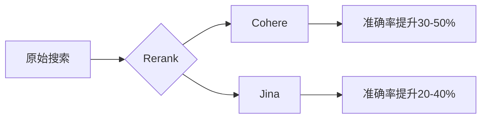

# Rerank 接入指南

## 🚀 快速开始

### 前置要求

!!! note "准备工作"
    1. 已获取相应的 API 密钥
       - [Cohere](https://cohere.ai) 或
       - [Jina](https://jina.ai)
    2. 确认账户有足够的调用额度

### 添加渠道

1. 进入管理后台 -> 渠道管理
2. 点击"新建渠道"
3. 选择对应类型
4. 填写配置信息：

=== "Cohere"
    ```json
    {
      "name": "Cohere Rerank",
      "type": "cohere",
      "key": "your-cohere-api-key",
      "base_url": "https://api.cohere.ai",
      "weight": 100,
      "models": ["rerank-english-v2.0", "rerank-multilingual-v2.0"]
    }
    ```

=== "Jina"
    ```json
    {
      "name": "Jina Rerank",
      "type": "jina",
      "key": "your-jina-api-key",
      "base_url": "https://api.jina.ai",
      "weight": 100,
      "models": ["jina-rerank-v1-base-en", "jina-rerank-v1-base-zh"]
    }
    ```

## 💫 功能特性

### 支持的模型

| 服务商 | 模型名称 | 特点 | 语言支持 |
|--------|----------|------|----------|
| Cohere | `rerank-english-v2.0` | 高精度英文重排 | 英文 |
| Cohere | `rerank-multilingual-v2.0` | 多语言支持 | 100+语言 |
| Jina | `jina-rerank-v1-base-en` | 轻量级英文重排 | 英文 |
| Jina | `jina-rerank-v1-base-zh` | 中文优化 | 中文 |

### 性能对比



## 📝 API 示例

### 基础调用

=== "Cohere"
    ```bash
    curl -X POST "https://your-domain/v1/rerank" \
      -H "Authorization: Bearer your-api-key" \
      -H "Content-Type: application/json" \
      -d '{
        "model": "rerank-english-v2.0",
        "query": "What is the capital of France?",
        "documents": [
          "Paris is the capital of France",
          "London is the capital of England",
          "Berlin is the capital of Germany"
        ],
        "top_n": 2
      }'
    ```

=== "Jina"
    ```bash
    curl -X POST "https://your-domain/v1/rerank" \
      -H "Authorization: Bearer your-api-key" \
      -H "Content-Type: application/json" \
      -d '{
        "model": "jina-rerank-v1-base-en",
        "query": "What is the capital of France?",
        "documents": [
          "Paris is the capital of France",
          "London is the capital of England",
          "Berlin is the capital of Germany"
        ],
        "top_n": 2
      }'
    ```

### 高级参数

```json
{
  "model": "rerank-english-v2.0",
  "query": "搜索查询",
  "documents": ["文档1", "文档2", "文档3"],
  "params": {
    "top_n": 2,
    "threshold": 0.7,
    "return_documents": true,
    "max_chunks_per_doc": 10
  }
}
```

## ⚙️ 参数配置

### 通用参数

| 参数 | 说明 | 默认值 | 可选值 |
|------|------|--------|--------|
| `top_n` | 返回结果数量 | `3` | `1` ~ `100` |
| `threshold` | 相关性阈值 | `0.0` | `0.0` ~ `1.0` |
| `return_documents` | 是否返回文档内容 | `true` | `true`, `false` |

### 安全设置

=== "Cohere"
    ```bash
    # 设置安全等级
    COHERE_SAFETY_SETTING=medium  # low, medium, high
    ```

=== "Jina"
    ```bash
    # 设置过滤规则
    JINA_FILTER_RULES=offensive,spam
    ```

## 🔍 性能优化

### 批处理

```python
async def batch_rerank(queries, documents, batch_size=32):
    results = []
    for i in range(0, len(queries), batch_size):
        batch_queries = queries[i:i + batch_size]
        batch_docs = documents[i:i + batch_size]
        batch_results = await rerank_documents(batch_queries, batch_docs)
        results.extend(batch_results)
    return results
```

### 缓存策略

```python
from functools import lru_cache

@lru_cache(maxsize=1000)
def cached_rerank(query, documents):
    return rerank_documents(query, documents)
```

## 💡 最佳实践

1. 文档预处理
   - 分段合适的长度
   - 去除无关内容
   - 标准化文本格式

2. 查询优化
   - 提取关键词
   - 扩展同义词
   - 规范化查询

3. 结果处理
   - 合并相似结果
   - 过滤低相关性
   - 多样性排序

4. 性能优化
   - 使用批处理
   - 实现结果缓存
   - 并行处理请求

## 🔧 故障排查

### 常见问题

1. 相关性低
   - 检查文档质量
   - 优化查询表达
   - 调整相关性阈值

2. 性能问题
   - 减小批处理大小
   - 优化文档长度
   - 使用结果缓存

3. 错误处理
   - 验证API密钥
   - 检查请求格式
   - 查看错误日志

### 监控指标

```yaml
metrics:
  latency:
    p95: 200ms
    p99: 500ms
  success_rate: 99.9%
  rerank_quality:
    ndcg@10: 0.8
    map@10: 0.7
```

!!! tip "优化建议"
    1. 定期评估重排效果
    2. 收集用户反馈
    3. 持续优化模型参数
    4. 监控系统性能 