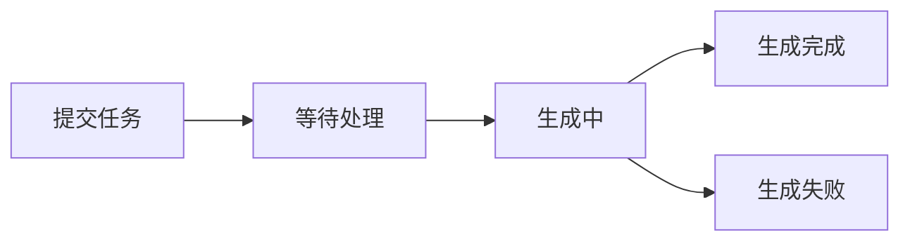

# Suno API 接入指南

## 🚀 快速开始

### 前置要求

!!! note "准备工作"
    1. 已注册 [Suno](https://suno.ai) 账号
    2. 已获取 Suno API 密钥
    3. 确认账户有足够的生成配额

### 添加渠道

1. 进入管理后台 -> 渠道管理
2. 点击"新建渠道"
3. 选择类型为 `Suno`
4. 填写配置信息：

```json
{
  "name": "Suno音频生成",
  "type": "suno",
  "key": "your-suno-api-key",
  "base_url": "https://api.suno.ai",
  "weight": 100,
  "models": ["suno/*"]
}
```

## 💫 功能支持

### 支持的模型

| 模型名称 | 说明 | 特点 |
|---------|------|------|
| `suno/bark` | 语音合成 | 高质量、多语言支持 |
| `suno/musicgen` | 音乐生成 | 多风格、可控制性强 |

### 模型特性

=== "Bark"
    - 支持多语言语音合成
    - 可控制语音情感和风格
    - 支持自定义说话人
    - 高质量音频输出

=== "MusicGen"
    - 多种音乐风格生成
    - 可控制音乐长度和节奏
    - 支持乐器组合
    - 高质量音频输出

## 📝 API 示例

### 语音合成 (Bark)

=== "基础请求"
    ```bash
    curl -X POST "https://your-domain/v1/audio/generations" \
      -H "Authorization: Bearer your-api-key" \
      -H "Content-Type: application/json" \
      -d '{
        "model": "suno/bark",
        "prompt": "你好，世界！",
        "voice": "default"
      }'
    ```

=== "高级参数"
    ```json
    {
      "model": "suno/bark",
      "prompt": "你好，世界！",
      "voice": "custom_voice_id",
      "params": {
        "language": "zh",
        "emotion": "happy",
        "speed": 1.0,
        "pitch": 1.0
      }
    }
    ```

### 音乐生成 (MusicGen)

=== "基础生成"
    ```bash
    curl -X POST "https://your-domain/v1/audio/generations" \
      -H "Authorization: Bearer your-api-key" \
      -H "Content-Type: application/json" \
      -d '{
        "model": "suno/musicgen",
        "prompt": "一段轻快的钢琴曲",
        "duration": 30
      }'
    ```

=== "高级控制"
    ```json
    {
      "model": "suno/musicgen",
      "prompt": "一段轻快的钢琴曲",
      "params": {
        "duration": 30,
        "tempo": 120,
        "genre": "classical",
        "instruments": ["piano"],
        "mood": "happy"
      }
    }
    ```

## 🔄 任务状态

### 状态流转



### 状态查询

```bash
curl -X GET "https://your-domain/v1/audio/generations/{task_id}" \
  -H "Authorization: Bearer your-api-key"
```

## ⚙️ 参数配置

### Bark 参数

| 参数 | 说明 | 默认值 | 可选值 |
|------|------|--------|--------|
| `language` | 语言 | `auto` | `zh`, `en`, `ja` 等 |
| `emotion` | 情感 | `neutral` | `happy`, `sad`, `angry` |
| `speed` | 语速 | `1.0` | `0.5` ~ `2.0` |
| `pitch` | 音高 | `1.0` | `0.5` ~ `2.0` |

### MusicGen 参数

| 参数 | 说明 | 默认值 | 可选值 |
|------|------|--------|--------|
| `duration` | 时长(秒) | `30` | `10` ~ `300` |
| `tempo` | 节奏 | `120` | `60` ~ `200` |
| `genre` | 风格 | `pop` | `classical`, `rock`, `jazz` |
| `mood` | 情绪 | `neutral` | `happy`, `sad`, `energetic` |

## 🔍 故障排查

### 常见问题

1. 生成失败
   - 检查API密钥是否有效
   - 确认账户额度充足
   - 验证参数是否合法

2. 音频质量问题
   - 调整生成参数
   - 使用更高质量设置
   - 检查输入文本质量

3. 响应超时
   - 增加超时时间
   - 使用异步模式
   - 实现断点续传

### 错误处理

```javascript
async function generateAudio(params) {
  try {
    const response = await fetch('/v1/audio/generations', {
      method: 'POST',
      headers: {
        'Authorization': `Bearer ${apiKey}`,
        'Content-Type': 'application/json'
      },
      body: JSON.stringify(params)
    });

    if (!response.ok) {
      throw new Error(`HTTP error! status: ${response.status}`);
    }

    const result = await response.json();
    return result;
  } catch (error) {
    console.error('Generation failed:', error);
    // 实现重试逻辑
    return await retryGeneration(params);
  }
}
```

## 💡 最佳实践

1. 提示词优化
   - 使用清晰的描述
   - 指定具体的风格
   - 添加情感和语气提示

2. 性能优化
   - 实现请求缓存
   - 使用异步生成
   - 优化音频处理流程

3. 用户体验
   - 显示生成进度
   - 提供预览功能
   - 支持参数调整

4. 资源管理
   - 监控使用配额
   - 清理临时文件
   - 实现音频压缩 