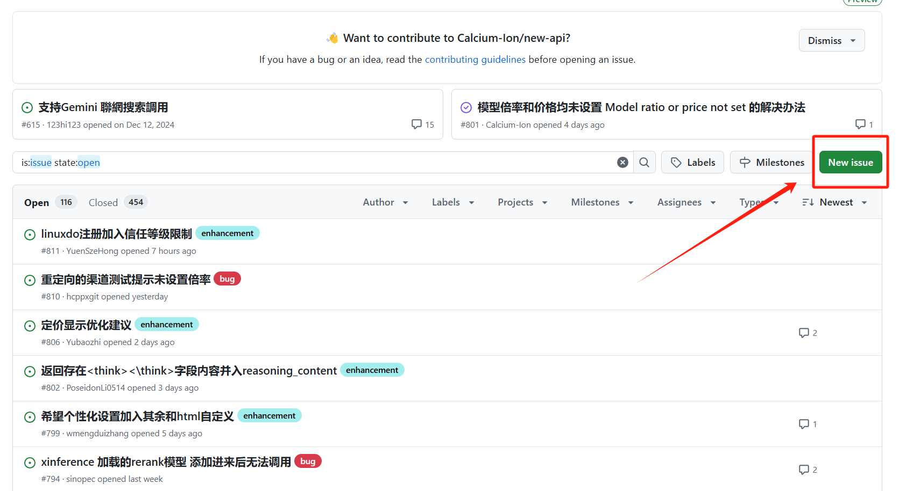

# 🐛 问题反馈

我们非常重视您的反馈，它们对项目的改进至关重要。如果您在使用过程中遇到任何问题，请通过GitHub Issues向我们反馈。

## 📝 如何提交问题

请访问我们的GitHub Issues页面：[New API Issues](https://github.com/Calcium-Ion/new-api/issues)

!!! tip "提交问题前的检查"
    在提交新的issue之前，建议您：
    
    1. 搜索是否已经存在类似的问题
    2. 确保使用的是最新版本
    3. 检查 [常见问题文档](faq.md) 中是否已有相关解答



## 💡 问题反馈模板

### 报告问题的格式

```markdown
**例行检查**

[//]: # (方框内删除已有的空格，填 x 号)
+ [ ] 我已确认目前没有类似 issue
+ [ ] 我已确认我已升级到最新版本
+ [ ] 我已完整查看过项目 README，尤其是常见问题部分
+ [ ] 我理解并愿意跟进此 issue，协助测试和提供反馈 
+ [ ] 我理解并认可上述内容，并理解项目维护者精力有限，**不遵循规则的 issue 可能会被无视或直接关闭**

**问题描述**

**复现步骤**

**预期结果**

**相关截图**
如果没有的话，请删除此节。
```

### 功能请求的格式

```markdown
**例行检查**

[//]: # (方框内删除已有的空格，填 x 号)
+ [ ] 我已确认目前没有类似 issue
+ [ ] 我已确认我已升级到最新版本
+ [ ] 我已完整查看过项目 README，已确定现有版本无法满足需求
+ [ ] 我理解并愿意跟进此 issue，协助测试和提供反馈
+ [ ] 我理解并认可上述内容，并理解项目维护者精力有限，**不遵循规则的 issue 可能会被无视或直接关闭**

**功能描述**

**应用场景**
```

!!! warning "注意事项"
    - 请严格按照模板格式提交issue
    - 请使用清晰的标题，方便其他用户搜索
    - 请及时关注和回复您提交的issue
    - 不符合规范的issue可能会被直接关闭
    - 如果问题已解决，请及时关闭issue
