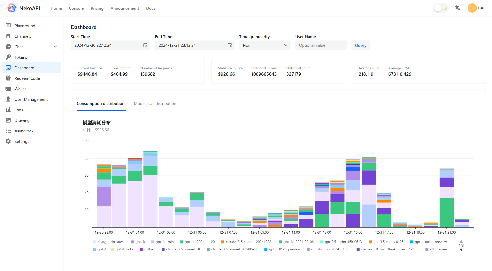
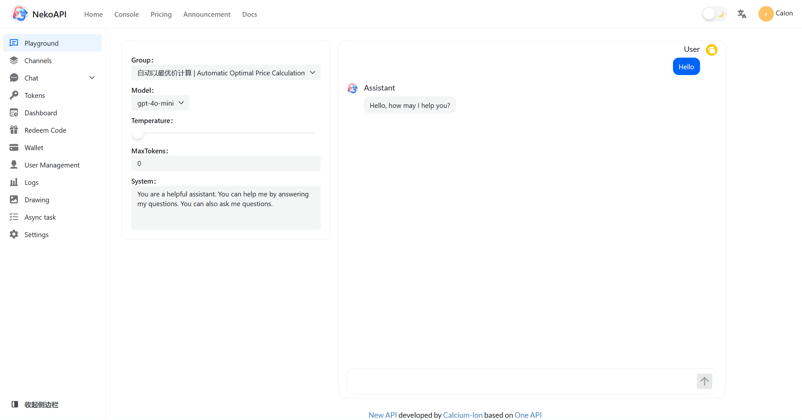

  

  <strong style="font-size: 1.5em">New API</strong>

  

New API 是一个新一代大模型网关与 AI 资产管理系统，基于 [One API](https://github.com/songquanpeng/one-api) 进行二次开发。该项目旨在提供一个统一的接口来管理和使用各种 AI 模型服务，包括但不限于 OpenAI、Anthropic、Midjourney 等。

## 📸 界面预览

-   :material-view-dashboard: __控制台__

    ---

    全新设计的数据统计看板，直观展示系统运行状态

    

-   :material-server: __渠道管理__

    ---

    统一管理各类AI模型接口，支持负载均衡

    

-   :material-play-circle: __游乐场__

    ---
    
    灵活的游乐场，可以测试各种模型

    

-   :material-clipboard-text-clock: __日志记录__

    ---

    详细的日志记录和分析，准备记录用户使用情况

    

## 📊 项目统计

## 📜 许可证

本项目采用 [Apache License 2.0](https://github.com/Calcium-Ion/new-api/blob/main/LICENSE) 开源许可证。这意味着您可以：

- ✅ 自由使用、修改和分发本项目的代码
- ✅ 将本项目用于商业用途
- ✅ 将修改后的代码以其他许可证发布

但您必须：

- ⚠️ 在修改后的文件中说明您做了修改
- ⚠️ 在您的项目中包含原始的许可证副本
- ⚠️ 在您的项目文档中声明使用了本项目
- ⚠️ 如果您修改了代码，需要在相关文件中保留原始的版权声明

## ⚠️ 免责声明

!!! danger "使用须知"
    1. 使用者必须遵循 OpenAI 的[使用条款](https://openai.com/policies/terms-of-use)以及相关法律法规
    2. 本项目仅供个人学习使用，不保证稳定性，且不提供技术支持
    3. 请遵守[《生成式人工智能服务管理暂行办法》](http://www.cac.gov.cn/2023-07/13/c_1690898327029107.htm)的相关规定
    4. 请遵守当地的政策与法规

