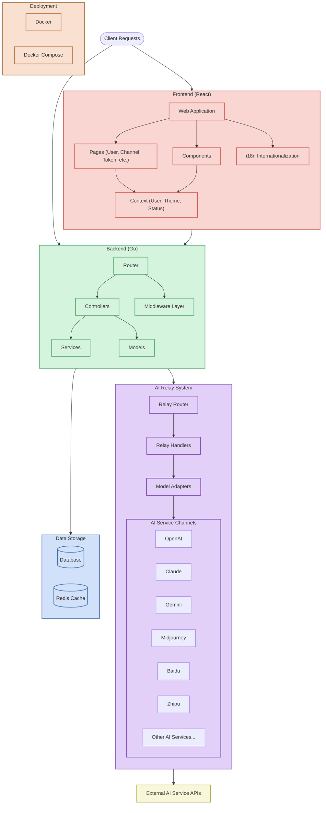

```mermaid
graph TD
    classDef frontend fill:#f9d6d2,stroke:#d36159,stroke-width:2px
    classDef backend fill:#d4f4dd,stroke:#57a870,stroke-width:2px
    classDef database fill:#d0e1f9,stroke:#4d76b0,stroke-width:2px
    classDef external fill:#f9f7d9,stroke:#b0af4a,stroke-width:2px
    classDef middleware fill:#e3d0f9,stroke:#8049b0,stroke-width:2px
    classDef deployment fill:#f9e0d0,stroke:#b07a49,stroke-width:2px

    Client(["Client Requests"])
    
    subgraph FrontEnd["Frontend (React)"]
        direction TB
        WebApp["Web Application"]
        Pages["Pages (User, Channel, Token, etc.)"]
        Components["Components"]
        Context["Context (User, Theme, Status)"]
        i18n["i18n Internationalization"]
        WebApp --> Pages & Components
        Pages --> Context
        Components --> Context
        WebApp --> i18n
    end
    
    subgraph BackEnd["Backend (Go)"]
        direction TB
        Router["Router"]
        Controller["Controllers"]
        Middleware["Middleware Layer"]
        Service["Services"]
        Model["Models"]
        
        Router --> Controller
        Controller --> Service
        Controller --> Model
        Router --> Middleware
    end
    
    subgraph RelaySystem["AI Relay System"]
        direction TB
        RelayRouter["Relay Router"]
        RelayHandler["Relay Handlers"]
        AdapterLayer["Model Adapters"]
        
        subgraph AIChannels["AI Service Channels"]
            OpenAI["OpenAI"]
            Claude["Claude"]
            Gemini["Gemini"]
            Midjourney["Midjourney"]
            Baidu["Baidu"]
            Zhipu["Zhipu"]
            OtherAI["Other AI Services..."]
        end
        
        RelayRouter --> RelayHandler
        RelayHandler --> AdapterLayer
        AdapterLayer --> AIChannels
    end
    
    subgraph Storage["Data Storage"]
        Database[(Database)]
        Redis[(Redis Cache)]
    end
    
    subgraph Deployment["Deployment"]
        Docker["Docker"]
        DockerCompose["Docker Compose"]
    end
    
    Client --> FrontEnd
    Client --> BackEnd
    FrontEnd --> BackEnd
    BackEnd --> RelaySystem
    BackEnd --> Storage
    RelaySystem --> AIExternalServices
    
    AIExternalServices["External AI Service APIs"] 
    
    class FrontEnd,WebApp,Pages,Components,Context,i18n frontend
    class BackEnd,Router,Controller,Middleware,Service,Model backend
    class Storage,Database,Redis database
    class RelaySystem,RelayRouter,RelayHandler,AdapterLayer,AIChannels middleware
    class AIExternalServices external
    class Deployment,Docker,DockerCompose deployment
```